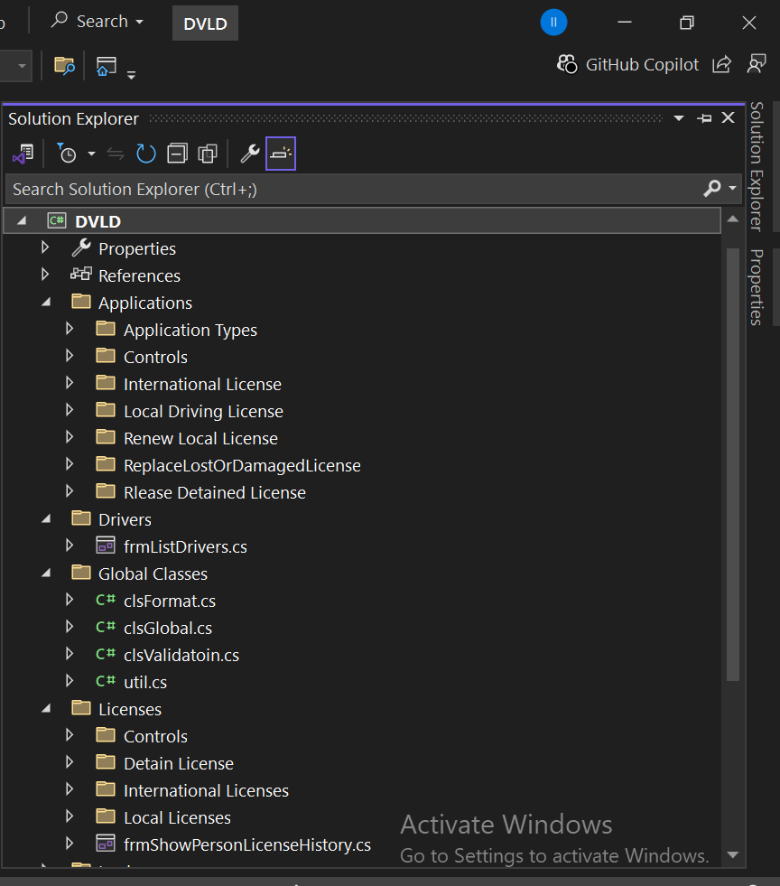
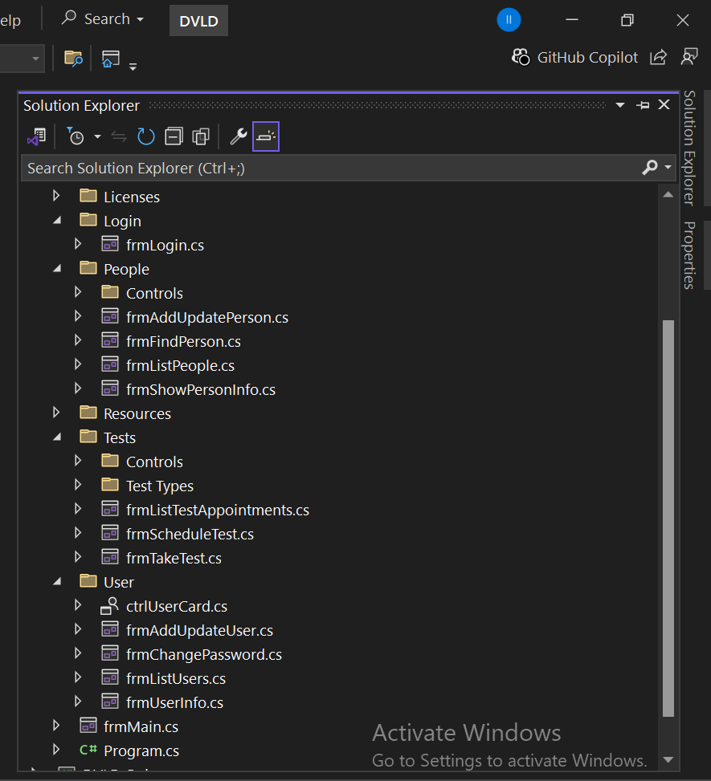
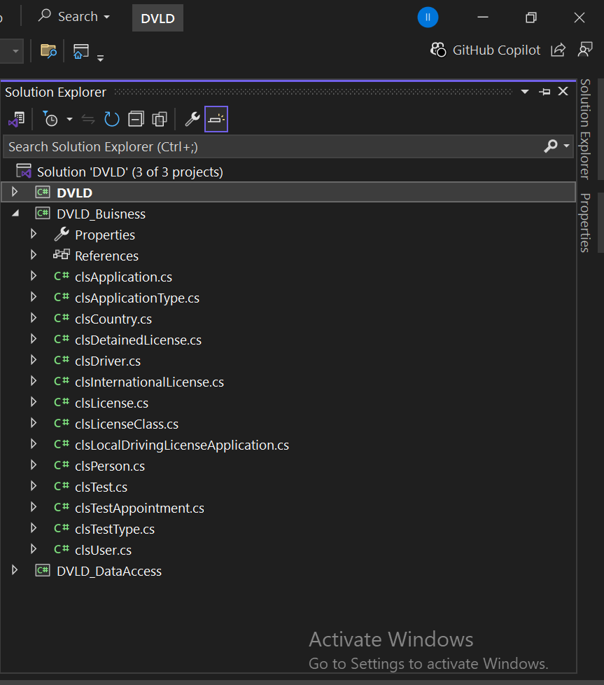
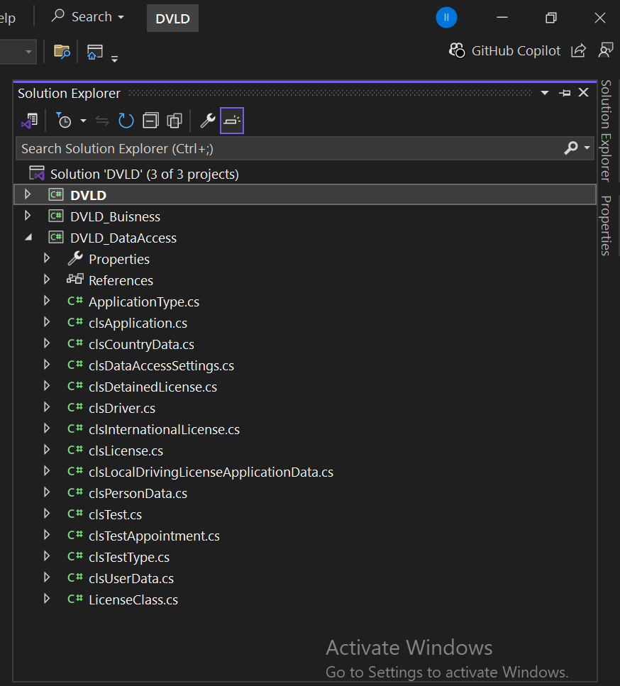
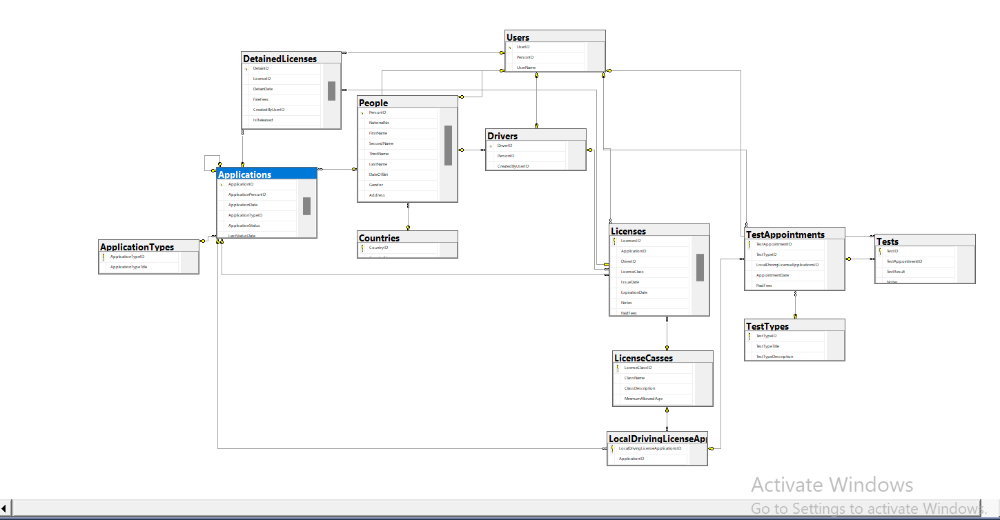

# 🚗 Driving and Vehicle Licensing Department (DVLD) Management System

This project is a comprehensive **desktop application** designed to manage the operations of a Driving and Vehicle Licensing Department (DVLD).  
It was **fully developed individually** as part of my personal software development practice using **C# and .NET Framework**.

This project represents my understanding of **enterprise-level desktop systems** using layered architecture, clean code principles, and database-driven logic.

The system manages everything from people's data and user accounts to complete licensing workflows — including applications, tests, and license issuance — following professional development standards and clean architecture.

---

## 🏗️ System Architecture

The application is built using a strict **3-Tier (N-Tier) Architecture**, which separates the system into three distinct logical layers:

1. **Presentation Layer (UI):**  
   Built with Windows Forms. Responsible for all user interaction and data display. Contains no business logic.  
   → Project: `DVLD`

2. **Business Logic Layer (BLL):**  
   The “brain” of the application — processes operations, validates data, and applies business rules.  
   → Project: `DVLD_Business`

3. **Data Access Layer (DAL):**  
   Handles all database communication and CRUD operations using ADO.NET.  
   → Project: `DVLD_DataAccess`

This architecture ensures clean separation of concerns, scalability, and easy maintenance — a cornerstone of professional software development.

---

## 📸 Screenshots (لقطات شاشة)

---

## 🗃️ Database Design

The system uses several main tables to manage all licensing operations efficiently:

| Table                               | Description                                                                                   |
| ----------------------------------- | --------------------------------------------------------------------------------------------- |
| **Applications**                    | Stores information about all license-related applications submitted by users.                 |
| **ApplicationTypes**                | Defines types of applications (New License, Renewal, Replacement, etc.).                      |
| **Countries**                       | Contains the list of countries used in driver and license records.                            |
| **DetainedLicenses**                | Records licenses that have been detained or suspended, including reasons and release details. |
| **Drivers**                         | Holds driver-specific data linked to people who have valid licenses.                          |
| **InternationalLicenses**           | Stores data for issued international driving licenses.                                        |
| **LicenseClasses**                  | Defines categories or classes of driving licenses (A, B, C, etc.).                            |
| **Licenses**                        | Stores all issued license records with validity dates and related info.                       |
| **LocalDrivingLicenseApplications** | Tracks local license applications and links them to the applicant.                            |
| **People**                          | Central table storing personal data such as name, national number, and contact information.   |
| **TestAppointments**                | Manages scheduled test appointments for applicants.                                           |
| **Tests**                           | Records actual test results and links them to the respective applications.                    |
| **TestTypes**                       | Defines the types of tests (Vision, Written, Practical).                                      |
| **Users**                           | Stores user login information, roles, and permissions within the system.                      |

---

## 🧩 Database Relationships Diagram (العلاقات بين الجداول)

Below is a simplified diagram showing the main relationships between key tables
in the DVLD Management System database:

People
│
├──< Applications >── ApplicationTypes
│ │
│ ├──< LocalDrivingLicenseApplications >
│ │ │
│ │ └──< Tests >── TestTypes
│ │ │
│ │ └──< TestAppointments >
│ │
│ └──< Licenses >── LicenseClasses
│ │
│ ├──< InternationalLicenses >
│ └──< DetainedLicenses >
│
└──< Drivers >
│
└──< Licenses >

Users
│
└── Manages all system operations (Applications, Tests, Licenses, etc.)
Countries
│
└── Referenced by People and Drivers tables

yaml
Copy code

---

## ✨ Key Features (المميزات الرئيسية)

### 👤 People Management

- Add, update, find, and list all people.
- View detailed personal information.

### 👥 User Management

- Add, update, and manage system users.
- Secure password management.
- Display user data via a reusable “User Card” control.

### 📝 Applications Management

- Manage various application types:  
  New Local License, Renewal, Replacement (Lost/Damaged), and International License.

### 🚗 License Management

- Issue new Local and International licenses.
- Manage license history per person.
- Detain and release licenses.

### ✔️ Test Management

- Schedule and manage Vision, Written, and Practical tests.
- Record and track test results and retakes.

---

## 🛠️ Technologies Used (التقنيات المستخدمة)

| Category         | Technology                                                                  |
| ---------------- | --------------------------------------------------------------------------- |
| **Language**     | C#                                                                          |
| **Framework**    | .NET Framework 4.8                                                          |
| **UI**           | Windows Forms                                                               |
| **Database**     | Microsoft SQL Server                                                        |
| **Data Access**  | ADO.NET (`SqlConnection`, `SqlCommand`, `SqlDataReader`, Stored Procedures) |
| **Architecture** | 3-Tier (Presentation, Business, Data Access Layers)                         |

---

## 🚀 How to Use (كيفية الاستخدام)

1. Set up the database using the provided SQL script.
2. Configure the connection string in the `app.config` file inside the `DVLD_DataAccess` project.
3. Open the `.sln` solution file in Visual Studio.
4. Build the solution to restore dependencies.
5. Run the project.
6. Log in using the default admin credentials (can be changed later).

---

## 🔮 Future Improvements

- Implement user roles and permissions.
- Add reporting and analytics dashboards.
- Introduce multi-language support.
- Improve the UI with modern design patterns.

---

## 👨‍💻 Developer

This project was **individually developed** by [Wael Mohammed](https://www.linkedin.com/in/wael-mohammed-sharif),  
focusing on **C#, .NET Framework, ADO.NET, 3-Tier Architecture, and SQL Server** to ensure scalability, performance, and clean code structure.

---

## 🏁 Summary

This project demonstrates how to build a **robust, database-driven desktop application** using professional architecture principles.  
It reflects a strong understanding of **software design patterns**, **data handling**, and **clean coding practices**.

---
